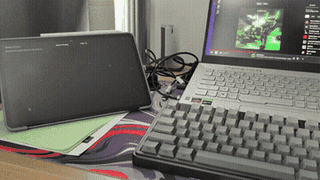

# Moreland

> This is a fork of [adiimanav/moreland](https://github.com/adiimanav/moreland) (check it out, it's good stuff!)
> that adds the KDE Plasma backend, the touch support, brightness
> and rotation control, the protocol conformance tests and other improvements.
> The upstream project documents the Hyprland path this fork builds on.
> **ALSO NOTE THAT ALL THE PATCHES WERE/ARE BEING MADE BY AN LLM, SO THIS IS AI SLOP,**
> **ALBEIT IT BEING PRETTY DECENT**.
> *This can be changed in the future, as the only reasons for me to use LLMs*
> *(primarily DeepSeek), is the lack of time and me not knowing Rust (and Kotlin).*

**Use an Android tablet as a second monitor on Linux/Wayland, over USB.**
An alternative for Hyprland - wired, not wireless.

Plug the tablet in and a virtual monitor appears. Unplug it and the monitor
disappears. Wayland-native, hardware-encoded, zero-copy - no VNC, no RDP, no X11.

<sub>_More land: more screen real estate. And it lives next door to Wayland and
Hyprland._</sub>

```
~19 ms    host → rendered on tablet, median round trip at 120 fps
120 fps   at 1920x1200        (90 is the default; 144 saturates)
16 Mbps   6% of the measured USB 2.0 ceiling
0.6%      of one CPU core for capture
```

> **Scope.** Verified on exactly one setup: Hyprland + AMD VA-API + a Xiaomi
> Pad 6. Other GPUs are plausible and untested; other compositors need work.
> See [Compatibility](#compatibility). Every number here is measured on that
> hardware, not estimated - see [`docs/`](docs/) for how.

Plug the cable in, and the tablet becomes a monitor - no pairing, no app to
launch on the host, no settings dialog:



## How it works

```
Hyprland  ──IPC──▶  headless output, sized to your tablet's aspect ratio
                          │
     ext-image-copy-capture-v1  (damage-driven, DMA-BUF)
                          ▼
              DMA-BUF on the GPU          ← pixels never touch the CPU
                          │  vapostproc: XR24 → NV12, in-GPU
                          ▼
              vah264enc  VBR, no B-frames
                          │  [len][pts][flags][Annex-B]
                          ▼
      adb forward ──▶ localabstract socket ──▶ USB
                          ▼
        MediaCodec (hardware) ──▶ SurfaceView
```

The whole path from compositor to encoder is zero-copy: the buffer Hyprland
renders into is the same buffer the video encoder reads. That holds only while
the compositor renders on the GPU that encodes - on a dual-GPU laptop it is easy
to have it silently not hold. See [Multi-GPU hosts](#multi-gpu-hosts).

## Requirements

**Host**

- Hyprland, or labwc with `wlr-randr` (see [Compatibility](#compatibility) for
  others)
- A GPU with VA-API encode - AMD, Intel, or NVIDIA via `nvidia-vaapi-driver`
- `gstreamer`, `gst-plugins-base`, `gst-plugin-va`, `libva`
- `android-tools` (adb), Rust toolchain

Arch / EndeavourOS:

```bash
sudo pacman -S --needed rust gstreamer gst-plugins-base gst-plugins-good \
                        gst-plugin-va libva android-tools android-udev wayland-utils
```

**Tablet**

- Android 10+ (API 29), with hardware H.264 decode - effectively any tablet
- USB debugging enabled
- A USB **data** cable - charge-only cables will not enumerate

USB 2.0 is fine. It measured 13× more bandwidth than this needs; USB 3 buys
nothing here.

## Install

```bash
git clone https://github.com/adiimanav/moreland.git moreland && cd moreland
./install.sh
```

Installs `~/.local/bin/moreland` and a systemd **user** unit. Nothing needs
root and nothing is written outside `$HOME`.

### Enable USB debugging

Settings → About tablet → tap **Build number** (MIUI/HyperOS: **OS version**)
seven times → back → Developer options → **USB debugging**. Replug and accept
the RSA prompt.

Verify: `adb devices -l` should list the tablet as `device`.

### Build and install the tablet app

Needs the Android SDK (`ANDROID_HOME`), platform 34, and JDK 17:

```bash
cd android
ANDROID_HOME=/opt/android-sdk ./gradlew assembleRelease
adb install -r app/build/outputs/apk/release/app-release.apk
```

<details>
<summary><code>INSTALL_FAILED_USER_RESTRICTED</code> on Xiaomi / MIUI / HyperOS</summary>

MIUI blocks ADB installs by default. Either enable Developer options →
**Install via USB**, or sideload without an account:

```bash
adb push app/build/outputs/apk/release/app-release.apk /sdcard/Download/
```

then on the tablet: **Files → Downloads → tap the APK → Install**.

</details>

### Run

```bash
moreland                                          # foreground
systemctl --user enable --now moreland.service    # on login
journalctl --user -u moreland -f                  # logs
```

Plug the tablet in. A monitor appears; drag windows to it.

## Usage

```
moreland                  watch for the tablet; stream whenever plugged in
moreland --once           stream one session, then exit
moreland --seconds 15     stop after 15 s and print latency statistics

--max-width <PX>           cap the auto-detected width   [default: 1920]
--native                   stream at the tablet's full panel resolution
--width <PX> --height <PX> pin an explicit resolution (both required)
--fps <N>                  virtual output refresh rate   [default: 90]
--bitrate <KBPS>           H.264 target bitrate          [default: 20000]
--position <X>             x offset of the virtual output [default: 0]
--position-y <Y>           y offset of the virtual output [default: 1080]
                           default sits below a primary at 0x0, no taller
                           than 1080px; override either axis to fit your
                           layout
--output-name <NAME>       name of the virtual output    [default: moreland]
                           required on labwc, which cannot create one and
                           must be pointed at an existing headless output
--show-cursor              composite the mouse cursor into the stream
```

**Resolution is automatic.** The daemon reads the tablet's panel size over ADB
and picks a matching aspect ratio, capped at `--max-width` so the encoder is not
asked to do more than the screen can show:

```
2880x1800 (16:10)  ->  1920x1200
2560x1440 (16:9)   ->  1920x1080
1280x800           ->  1280x800     (already below the cap)
```

`--native` streams the panel's full resolution. On a 2880×1800 tablet that is
2.5× the pixels of 1080p and will push the encoder hard for detail you cannot
resolve on an 11" screen - measure before keeping it.

## Performance

Measured at 1920×1200@60 on a Ryzen 7 5800HS with AMD Vega, streaming to a
Xiaomi Pad 6 over USB 2.0.

| Stage                              | Latency                              |
| ---------------------------------- | ------------------------------------ |
| Capture → DMA-BUF                  | **2.1 ms**                           |
| VAAPI encode                       | **6.3 ms**                           |
| Transport + decode + display queue | **24.2 ms**                          |
| Panel scanout                      | 7–16 ms (not measurable in software) |
| **Glass to glass**                 | **~33–48 ms**                        |

Sustained 60.07 fps, 99.7% of frames acknowledged as rendered, 16.2 Mbps.

### Frame rate

Round trip is _host send → device render → host ack_, measured over 25 s with a
full-screen animating client on the virtual output. Measuring against an **idle**
output instead reports ~1 fps and a ~800 ms median — that is the compositor
correctly not redrawing a static screen, not the pipeline.

| `--fps` | frames | unacked | median   | p95      | max        |
| ------- | ------ | ------- | -------- | -------- | ---------- |
| 60      | 1193   | 3       | 33.5 ms  | 34.8 ms  | 62.6 ms    |
| 90      | 1567   | 6       | 25.5 ms  | 33.4 ms  | 61.1 ms    |
| **120** | 2022   | 22      | **18.8 ms** | **29.0 ms** | **50.8 ms** |
| 144     | 1764   | **163** | 26.4 ms  | 31.3 ms  | **208.5 ms** |

**Higher frame rates lower latency**, which is not obvious: a shorter frame
interval means less time waiting for the next slot. They also cost *fewer* bytes
— 49.7 MB at 60 fps versus 41.9 MB at 120 — because smaller inter-frame deltas
compress better. 144 is past the wall: a tenth of its frames go unacknowledged
and the tail blows out to 208 ms.

At a fixed bitrate, more frames means fewer bits each, so raise `--bitrate`
alongside `--fps` for video or photo work. At 120 fps the encoder drew 16 Mbps
against a measured 275 Mbps USB ceiling, so headroom is not the constraint.

### Multi-GPU hosts

On a laptop with both an integrated and a discrete GPU, **the compositor must
render on the same GPU that encodes**. If it does not, every captured frame is
copied across the PCIe bus before the encoder sees it, and the "zero-copy" path
above is not zero-copy at all.

Check which GPU your panel is actually wired to:

```bash
for s in /sys/class/drm/card*-*/status; do
    [ "$(cat "$s")" = connected ] && echo "$(basename "$(dirname "$s")")"
done
```

On the reference machine the internal panel hangs off the iGPU while the
compositor was rendering on the dGPU — so frames crossed the bus twice, once to
reach the encoder and once to reach the screen. Pinning Hyprland to the iGPU
(`AQ_DRM_DEVICES`) removed both copies and let the dGPU runtime-suspend. Note
that `AQ_DRM_DEVICES` is colon-separated, so `/dev/dri/by-path/` names cannot be
used in it, and `cardN` numbering follows module probe order — a udev `SYMLINK+=`
is the stable way to name a device.

**Sub-20 ms glass to glass is still not achievable**, and the 18.8 ms above is
not a counter-example: that is host send → device render → host ack, which stops
at the point the tablet's compositor accepts the frame. Panel scanout (7–16 ms,
not measurable in software) sits after it, so glass to glass at 120 fps is
roughly 26–35 ms. The display pipeline on the tablet dominates and is not ours
to control. For calibration, [scrcpy](https://github.com/Genymobile/scrcpy) - the
most optimised project in this space - measures 25–45 ms running the same
pipeline in the opposite direction. This is fine for video, documents,
terminals, and browsing; it is not fine for gaming or stylus work.

## Compatibility

|                       | Status                                                                                              |
| --------------------- | --------------------------------------------------------------------------------------------------- |
| **Hyprland**          | Verified, including 0.56's Lua config parser (see below)                                            |
| labwc                 | Works, contributed and used by its author, untested here - you create the headless output, moreland attaches to it ([details](docs/COMPATIBILITY.md#labwc--works-with-the-output-created-by-you)) |
| Sway / other wlroots  | Capture should work unchanged; output creation unimplemented                                        |
| KDE Plasma (KWin)     | **Works** via `zkde_screencast_unstable_v1` + PipeWire - see [docs/06-plasma-backend.md](docs/06-plasma-backend.md) |
| GNOME (Mutter)        | Requires a portal/PipeWire capture backend; Mutter implements neither wlr nor ext capture protocols |
| AMD VA-API            | Verified                                                                                            |
| Intel / NVIDIA VA-API | Plausible, untested - modifiers are probed at runtime                                               |
| Android 10+           | Verified on 14; nothing vendor-specific required                                                    |

To check your own machine:

```bash
./scripts/moreland-doctor.sh
```

It reports the compositor, the capture protocol, the VA-API encoder and the ADB
link, and names whatever blocks you. Note that your **distribution is not the
deciding factor** - the compositor is. Fedora or Debian running Hyprland should
work; Arch running Plasma does not.

On a compositor that implements `ext-image-copy-capture-v1`, only **one** stage
is compositor-specific: creating the headless output. Capture uses that standard
protocol, encoding uses VA-API, transport uses ADB - so adding such a compositor
means implementing create/remove in
[`crates/daemon/src/output.rs`](crates/daemon/src/output.rs) and nothing else.
A compositor *without* the protocol - KDE, GNOME - is a much larger job: a
second, PipeWire-based capture backend.

### Hyprland's Lua config parser

Hyprland 0.56 can run a Lua config instead of the legacy `.conf` format, and
under it **`hyprctl keyword` refuses to work** - printing
`keyword can't work with non-legacy parsers. Use eval.` to *stdout* and exiting
**0**. Anything that checks only the exit status sees success.

That is how the daemon set the virtual output's mode, position and scale, so on
a Lua config all three were silently dropped and the output kept the
compositor's defaults: `auto` position, and `auto` scale, which on a headless
output (physical size `0x0`) resolves to **2** - a monitor where everything is
twice the size. The daemon now detects that reply and reissues the rule through
`hyprctl eval`, which the Lua parser accepts. Genuine errors there exit non-zero
and are still caught.

The same applies to `hyprctl dispatch`: bare-word syntax is parsed as Lua and
no-ops. Use `hyprctl eval 'hl.exec_cmd("...")'` or
`hyprctl dispatch 'hl.dsp.exec_cmd("...")'`.

A static `hl.monitor{}` rule for the output is still worth keeping. Runtime
rules are discarded on config reload, and with no static entry the output falls
back to `auto` scale mid-session. A rule for an absent output is simply stored,
so it is harmless while the tablet is unplugged.

## Known limitations

- **Touch is single-contact only.** The tablet drives a uinput touchscreen
  (or, with `--touch-mode pointer`, an absolute pointer). Pen, pressure, tilt
  and multi-touch are out of scope. See [docs/TOUCH.md](docs/TOUCH.md).
- **The app must stay foregrounded.** Switching apps on the tablet stops the stream.
- **No audio.** Video only.
- **Idle output drops to ~1 fps.** Correct, not a bug: Hyprland does not render a
  static headless output, so a motionless screen costs almost nothing. It jumps
  straight back to the configured rate on damage. Worth knowing when
  benchmarking: measuring against an empty virtual output reports the idle rate,
  not the pipeline's.
- **Mild softness** from upscaling and H.264 on dark backgrounds. Raise
  `--bitrate` or `--max-width` if it bothers you.
- **Resizing the virtual output mid-session** restarts the pipeline - the encoder
  and decoder are both configured for a fixed geometry.

## Security

Read before publishing or installing.

**No network exposure.** `adb forward` binds `127.0.0.1` only. Nothing listens
on an external interface, and no traffic leaves the machine or the USB cable.

**The trust boundary is your local machine and your tablet.** Two consequences
on a shared or multi-user system:

- Any local process able to reach `127.0.0.1:27183` can push frames to the
  tablet while the daemon is running.
- Any app on the tablet can connect to the `localabstract:moreland` socket.
  Abstract Unix sockets carry no filesystem permissions.

Neither is exploitable for anything beyond drawing on the tablet's screen, and
neither reaches back into the host. But this is a single-user desktop tool and
is not hardened for a hostile local user.

**The app requests no Android permissions at all** - not even `INTERNET`. It can
draw to its own surface and nothing else.

**Wire data is bounds-checked** on both sides: magic and version on the stream
header, and a frame-length cap on the device so a malformed length cannot drive
a huge allocation.

**Two `unsafe` blocks**, both mapping buffers the kernel just gave us, both
commented with their invariants.

**Enabling USB debugging is the real security decision here**, and it is not
specific to this project. An authorised ADB host has broad access to the device.
Revoke authorisations when you are done: Developer options → _Revoke USB
debugging authorisations_.

**Build the APK yourself.** Release builds are signed with the Android _debug_
key, which is a shared, publicly-known key - fine for sideloading something you
compiled, meaningless as provenance. Do not trust a prebuilt APK from anyone,
including this repo.

## Documentation

Each stage is documented with what was built, what was measured, and what went
wrong:

| Doc                                             |                                                                |
| ----------------------------------------------- | -------------------------------------------------------------- |
| [00-system-survey.md](docs/00-system-survey.md) | Hardware probing, transport evaluation, architecture decisions |
| [01-capture.md](docs/01-capture.md)             | Virtual output and zero-copy capture                           |
| [02-encode.md](docs/02-encode.md)               | VA-API encoding and tuning                                     |
| [03-transport.md](docs/03-transport.md)         | Wire protocol and USB transport                                |
| [04-android-app.md](docs/04-android-app.md)     | The tablet app                                                 |
| [05-daemon.md](docs/05-daemon.md)               | Hotplug detection and the service                              |
| [COMPATIBILITY.md](docs/COMPATIBILITY.md)       | What other compositors and GPUs need                           |
| [REVERT.md](docs/REVERT.md)                     | How to undo everything                                         |

## Uninstall

```bash
systemctl --user disable --now moreland.service
rm -f ~/.local/bin/moreland ~/.config/systemd/user/moreland.service
adb uninstall com.moreland.display
```

Full inventory in [`docs/REVERT.md`](docs/REVERT.md).

## Contributing

Especially wanted:

- **Compositor backends** - Sway is the smallest step (labwc is done); KWin the
  most requested
- **A portal/PipeWire capture backend**, which would make GNOME and KDE work at once
- **Intel and NVIDIA reports**, positive or negative
- **Multi-contact touch** - currently a single contact point only

Please include your compositor, GPU, driver version, and tablet model. A
documented failure is more useful than silence.

## License

Apache-2.0. See [LICENSE](LICENSE).
